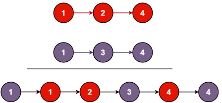

You are given the heads of two sorted linked lists list1 and list2.

Merge the two lists into one sorted list. The list should be made by splicing together the nodes of the first two lists.

Return the head of the merged linked list.

 

Example 1:

Input: list1 = [1,2,4], list2 = [1,3,4]
Output: [1,1,2,3,4,4]
Example 2:

Input: list1 = [], list2 = []
Output: []
Example 3:

Input: list1 = [], list2 = [0]
Output: [0]
 

Constraints:

The number of nodes in both lists is in the range [0, 50].
-100 <= Node.val <= 100
Both list1 and list2 are sorted in non-decreasing order.

# Intuition
用node建構一個新的linkList原點，或arr[0]，透過next指向下一個index並使用while及if反覆確認List1、List2大小後，由小到大填入值進新的linkList。
# Approach
定義時List1、List2即可代表List1[0]、List2[0]，順著index比較大小並填入linkList，最後將剩餘的List元素(較大的)放入，在if函數中沒被放入的list元素會繼續在下一次被比較。
# Complexity
- Time complexity:
O(m + n)，因为在 while 循环中，我们遍历了两个链表一次，每次比较两个节点的值，然后将较小的节点添加到合并后的链表中。
- Space complexity:
O(1)，没有使用额外的数据结构来存储节点。